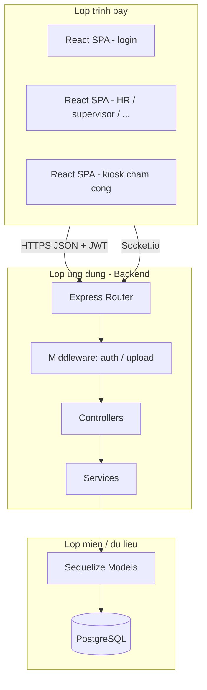
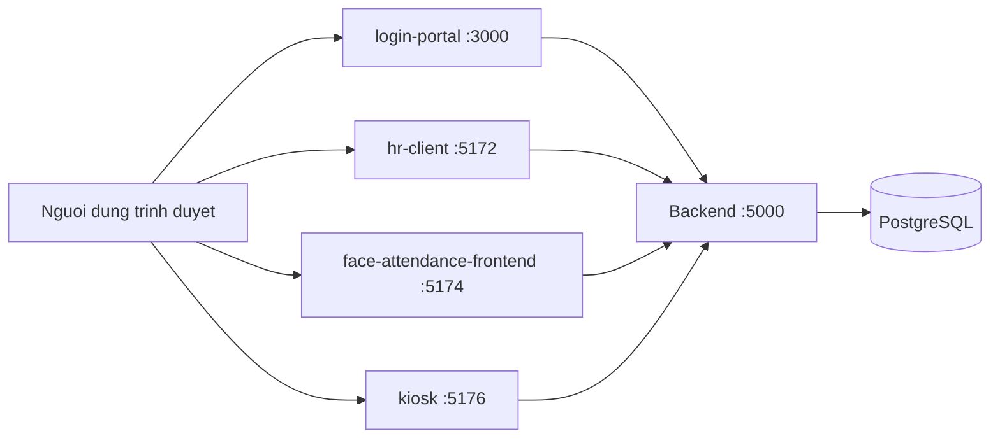

# 2. Cau truc va mo hinh he thong (ban mo rong)

Chuong nay mo ta **cay thu muc**, **luong du lieu**, **cac lop phan mem**, va **hanh vi dinh ky** cua backend — phu hop de **dan vao Word** lam muc "Kien truc he thong" / "Mo hinh tong quat".

---

## 2.0. Dinh nghia pham vi du an (scope)

| Thanh phan | Mo ta ngan |
|------------|------------|
| **Nguoi dung** | Nhan vien, giam sat, HR, ke toan, quan ly (manager) — moi vai tro mot hoac nhieu SPA. |
| **Chuc nang cot loi** | Dang nhap, ho so, to chuc (phong/chuc danh), **cham cong bang khuon mat**, don tu, luong & bao hiem, bao cao. |
| **Khong gian trien khai dev** | Tat ca chay `localhost` voi port co dinh; production can reverse proxy, HTTPS, bien moi truong bao mat. |

---

## 2.1. Cau truc thu muc goc (monorepo) — chi tiet

```
PROJECCT_KY_9/
├── package.json                 # Script dev tong: concurrently nhieu service
├── .github/workflows/           # CI/CD GitHub Actions
├── Bao_Cao_Du_AN/             # Tai lieu bao cao (Markdown)
├── face-attendance-backend/     # API Node.js + Express
│   └── src/
│       ├── index.js             # Khoi dong app, mount route, Sequelize sync, cron
│       ├── routes/              # Dinh nghia URL -> controller
│       ├── controllers/         # Xu ly request/response HTTP
│       ├── services/            # Logic nghiep vu tach rieng
│       ├── models/pg/           # Sequelize — PostgreSQL
│       ├── models/mongo/        # Mongoose — mau / phu
│       ├── middleware/          # auth JWT, phan quyen
│       ├── config/              # permissionMatrix, db
│       ├── db/                  # sequelize.js, migrations, pgClient, mongo.js
│       ├── socket.js            # Socket.io
│       ├── swagger.js           # OpenAPI
│       └── utils/
├── login-portal/
├── face-attendance-frontend/
├── face-attendance-employee/
├── hr-client/
├── supervisor-client/
├── accountant-client/
├── employee-portal/
└── payroll-frontend/
```

**Giai thich monorepo:** Mot repo git chua nhieu **goi npm** doc lap; loi ich: chia se tai lieu, CI thong nhat, phien ban backend mot nguon cho tat ca frontend.

---

## 2.2. Mo hinh tong quat (logic) — nhieu lop



**Tu khoa khi viet Word:** *presentation layer*, *application layer*, *data layer*, *single source of truth* (PostgreSQL).

---

## 2.3. Luong dien hinh end-to-end (tung buoc)

### Buoc A — Dang nhap

1. Nguoi dung nhap email/mat khau tai `login-portal` (hoac form trong app).
2. Frontend gui `POST /api/auth/login` (hoac tuong duong trong `authRoutes`).
3. `authController` tim `User`, `bcrypt.compare` mat khau, tao `jwt.sign`.
4. Frontend luu token; moi request sau co header `Authorization: Bearer <token>`.

### Buoc B — Goi API co bao ve

1. `authMiddleware` giai ma JWT, gan `req.user` (id, role, ...).
2. `authorize` kiem tra role duoc phep tren route (theo `permissionMatrix`).
3. Controller goi Sequelize `Model.findAll` / `create` / `update`.
4. Tra JSON `{ status, data }` hoac ma loi HTTP chuan.

### Buoc C — Cham cong khuon mat

1. Trinh duyet: load model face-api -> camera -> sinh **embedding** (mang so).
2. `POST` len endpoint attendance/enroll tuong ung.
3. Backend: `matchService` hoac logic trong controller so sanh khoang cach vector voi `FaceProfile`.
4. Ghi ban ghi `AttendanceLog` (thoi diem, userId, confidence, ...).
5. Co the tao `Notification`, emit Socket.io toi phong `role:hr` hoac `userId`.

### Buoc D — Realtime

1. Client `socket.io-client.connect('http://localhost:5000')`.
2. `socket.emit('join-room', { room: '...' })`.
3. Server khi co su kien goi `emitToRoom(room, event, payload)`.

---

## 2.4. Tac vu dinh ky tren server (background)

Trong `face-attendance-backend/src/index.js` dung `setInterval`:

| Chu ky | Ham / service | Muc dich nghiep vu |
|--------|---------------|-------------------|
| 60 phut | `checkLateArrivals` | Phat hien di muon, tao thong bao |
| 24 gio | `checkContractExpiration` | Nhac hop dong sap het han |
| 24 gio | `notifyBirthdays`, `notifyWorkAnniversaries` | Thong bao sinh nhat / ky niem |

**Luu y ky thuat:** Day la cron **don gian** bang `setInterval`; production lon co the chuyen sang **job queue** (Bull, cron container) de chinh xac gio hon.

---

## 2.5. Tai nguyen tinh va file upload

| Duong dan URL | Thu muc vat ly | Muc dich |
|---------------|----------------|----------|
| `/uploads/...` | `face-attendance-backend/uploads/` (theo `process.cwd()`) | Avatar, hop dong scan, tai lieu |

**Bao mat:** Khong nen de upload chay file thuc thi; chi luu file anh/pdf; kiem tra `mimeType` va kich thuoc.

---

## 2.6. Tai lieu API (Swagger)

- URL khi dev: `http://localhost:5000/docs`
- Nguon mo ta: `src/swagger.js` (OpenAPI).
- **Cach dung trong bao cao:** Chen anh chup man hinh Swagger lam "Phu luc API".

---

## 2.7. Socket.io va CORS

- File `src/socket.js` khai bao `origin` duoc phep (cac port localhost frontend).
- Neu mot app moi (vi du port khac) bi loi ket noi Socket, can **them origin** vao mang `cors.origin`.
- **employee-portal (5178)** can kiem tra da co trong danh sach hay chua khi test realtime.

---

## 2.8. Bao mat — lop tong quan (de viet muc "Giai phap bao mat")

| Lop | Bien phap trong du an |
|-----|----------------------|
| Xac thuc | JWT, mat khau bcrypt, `tokenVersion` khi doi role |
| Phan quyen | RBAC theo `role`, middleware `authorize` |
| Duong truyen | Dev: HTTP; Production nen HTTPS |
| Du lieu nhay cam | Khong tra password trong API; gioi han truong tra ve theo vai tro |
| File | Luu ngoai web root logic; chi phuc vu qua route kiem soat neu can |

---

## 2.9. So do trien khai dev (nhieu tien trinh)



**Khi chuyen Word:** so do Mermaid can xuat hinh (xem file `05-Huong-dan-chuyen-Word.md`).

