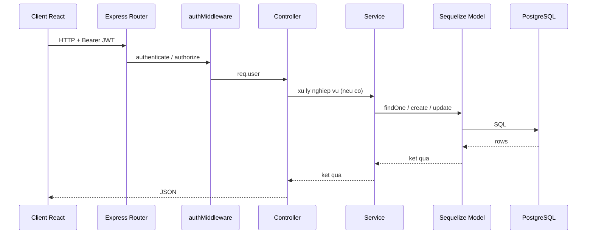

# 3. Client, port, backend, luong giua cac lop (ban mo rong cho Word)

Chuong nay gom: **bang tung ung dung client** (port, doi tuong su dung, chuc nang), **endpoint API theo nhom**, **danh muc module backend**, **vi du luong class/controller/service/model**, va **goi y cau hoi thay co co the hoi**.

---

## 3.0. Tong quan kien truc client — server

| Lop | Ky thuat | Ghi chu |
|-----|----------|---------|
| Client | 8 ung dung React + Vite (tru khi ghi khac) | Moi app mot port dev co dinh |
| Server | Express tren Node.js | Port mac dinh **5000** |
| CSDL | PostgreSQL | Truy cap qua Sequelize |
| Realtime | Socket.io | Cung port 5000 voi HTTP |
| Tai lieu API | Swagger UI tai `/docs` | Mo ta REST |

---

## 3.1. Bang chi tiet tung client (de dan vao Word)

| STT | Thu muc | Port | Doi tuong nguoi dung | Chuc nang chinh (goi y mo ta) | Cong nghe noi bat trong goi |
|-----|---------|------|----------------------|------------------------------|-----------------------------|
| 1 | `login-portal` | **3000** | Tat ca vai tro | Dang nhap tap trung; sau do chuyen huong sang app dung role | React 19, Vite 7 |
| 2 | `hr-client` | **5172** | Bo phan nhan su | Quan ly ho so, to chuc, don tu HR (theo code tung man) | React 19, socket.io-client |
| 3 | `supervisor-client` | **5173** | Giam sat / quan ly line | Xem team, duyet / giam sat (theo man hinh da lam) | React 19, recharts, socket.io-client |
| 4 | `face-attendance-frontend` | **5174** | Quan ly / admin he thong | Dashboard, quan ly user, ca, cham cong, luong, bao hiem, bao cao, nhieu module trong mot SPA | React 19, Redux Toolkit, face-api, tfjs, socket.io, xlsx, jspdf, ... |
| 5 | `accountant-client` | **5175** | Ke toan | Bao cao, bieu do, xuat Excel/PDF/Word | React 19, recharts, xlsx, jspdf, socket.io-client |
| 6 | `face-attendance-employee` | **5176** | Nhan vien tai kiosk | Cham cong bang khuon mat; giao dien kiosk | React 18, @vladmandic/face-api |
| 7 | `payroll-frontend` | **5177** | Chuyen trach bang luong / payroll | Man hinh payroll chuyen biet, Tailwind, React Query | React 18, Tailwind, axios, zustand, react-query |
| 8 | `employee-portal` | **5178** | Nhan vien | Cong thong tin ca nhan: ho so, thong bao, don (theo man) | React 19, socket.io-client |

**Backend:**

| Thanh phan | Port / duong dan | Ghi chu |
|------------|------------------|---------|
| API HTTP | **5000** (bien `PORT`) | `http://localhost:5000/api/...` |
| Health check | `GET /api/health` | JSON `status: ok` |
| Swagger | `GET /docs` | Tai lieu OpenAPI |
| Socket.io | cung host:5000 | Khong mo port rieng |

---

## 3.2. Bien moi truong frontend (thuong gap)

Cac app Vite thuong doc bien bat dau bang `VITE_`, vi du:

| Bien (vi du) | Y nghia |
|--------------|---------|
| `VITE_API_BASE` | URL backend (mac dinh nhieu cho dung `http://localhost:5000`) |

**Khi viet Word:** ghi ro "Cau hinh deploy: dat `VITE_API_BASE` tro toi domain API production".

---

## 3.3. Nhom API REST (prefix da mount trong `src/index.js`)

Bang duoi gom **prefix** va **nghiep vu** (de thay co hoi "API lam gi").

| Prefix mount | Nhom nghiep vu |
|--------------|----------------|
| `/api/auth` | Dang ky (neu mo), dang nhap, doi mat khau, lay profile |
| `/api/enroll` | Dang ky nhan vien + khuon mat / ho so ban dau |
| `/api/attendance` | Ghi nhan / tra cuu cham cong, khop khuon mat |
| `/api/admin` | Thao tac quan tri he thong |
| `/api/anti-spoof` | Chong gia mao (neu tich hop) |
| `/api/shifts` | Cau hinh ca lam viec |
| `/api/salary` | Luong thang, tinh luong, quy tac |
| `/api/employee` | CRUD / tim kiem nhan vien |
| `/api/leave` | Don nghi phep |
| `/api/analytics` | Thong ke, dashboard data |
| `/api/notifications` | Thong bao nguoi dung |
| `/api/departments` | Phong ban |
| `/api/job-titles` | Chuc danh |
| `/api/qualifications` | Bang cap / chung chi |
| `/api/dependents` | Nguoi phu thuoc |
| `/api/work-experiences` | Kinh nghiem lam viec |
| `/api/documents` | Tai lieu ho so |
| `/api/overtime-requests` | Dang ky tang ca |
| `/api/business-trip-requests` | Don cong tac |
| `/api/salary-advances` | Tam ung luong |
| `/api/salary-grades` | Ngach luong |
| `/api/seniority-salary` | Luong tham nien |
| `/api/insurance-configs` | Ty le bao hiem |
| `/api/insurance` | Tinh / thong tin bao hiem |
| `/api/reports` | Bao cao tong hop |
| `/api/tax` | Thue |
| `/api/export` | Xuat Excel / bao cao |
| `/api/insurance-forms` | Form TK1-TS, D02-LT (JSON) |
| `/api` (debug) | Route go loi (chi dev) |

**Ghi chu ky thuat:** File `src/routes/payrollRoutes.js` dinh nghia nhieu endpoint payroll nhung viet bang **CommonJS** (`require`) va **chua** duoc `import` + `app.use` trong `index.js` phien ban **ESM** hien tai. Khi bao cao, nen noi thang: *"Module payroll doc lap chua gan vao server chinh; bang luong van co the qua `/api/salary` va model `Payroll`."*

---

## 3.4. Luong request giua cac lop (chi tiet)

### 3.4.1. Mo hinh chuoi xu ly (chuoi lop)

1. **Trinh duyet** gui HTTP (JSON), header `Authorization: Bearer <JWT>`.
2. **Express** nhan request, chuyen toi **Route** (`routes/*.js`): dinh method, path, middleware.
3. **authMiddleware**: xac minh JWT, gan `req.user`.
4. **authorize(role)**: kiem tra vai tro duoc phep.
5. **Controller**: doc `req`, goi **Service** (neu can) va/hoac **Model**.
6. **Service**: logic nghiep vu (tinh luong, thue, workflow duyet, ...).
7. **Sequelize Model**: truy van **PostgreSQL**.
8. **Controller** tra **JSON** cho client.

**Tuong duong "class" trong lap trinh huong doi tuong:**

- **Route:** dinh nghia "phuong thuc + URL" — khong chua logic nghiep vu day.
- **Controller:** dieu phoi 1 request; goi DB hoac service.
- **Service:** ham thuan (async) — de test va tai su dung giua nhieu controller.
- **Model:** anh xa 1 bang; quan he trong `models/pg/index.js`.

### 3.4.2. Vi du cu the (de noi truoc lop)

| Vi du | Route (file) | Controller | Service / Model |
|-------|--------------|------------|-----------------|
| Dang nhap | `authRoutes.js` | `authController.login` | `User`, `bcrypt`, `jwt` |
| Cham cong | `attendanceRoutes.js` | `attendanceController` | `AttendanceLog`, `FaceProfile`, co the `matchService` |
| Tinh luong | `salaryRoutes.js` | `salaryController` | `salaryCalculationService`, `Salary`, `SalaryRule` |
| Thong ke | `analyticsRoutes.js` | `analyticsController` | `analyticsService` |
| Duyet don | `overtimeRoutes.js`, ... | `overtimeController` | `approvalPolicyService`, `OvertimeRequest`, `ApprovalWorkflow` |
| Thue | `taxRoutes.js` | `taxController` | `taxService` |
| Xuat Excel | `excelExportRoutes.js` | `excelExportController` | `excelExportService` |

### 3.4.3. So do sequence (Mermaid)

*(Khi dan Word: xuat hinh tu mermaid.live — xem file05.)*

---

## 3.5. Danh muc backend (gom nhom)

### A. Routes — `src/routes/` (30 file)

`adminRoutes`, `analyticsRoutes`, `antiSpoofRoutes`, `attendanceRoutes`, `authRoutes`, `businessTripRoutes`, `debugRoutes`, `departmentRoutes`, `dependentRoutes`, `documentRoutes`, `employeeRoutes`, `enrollRoutes`, `excelExportRoutes`, `insuranceConfigRoutes`, `insuranceFormRoutes`, `insuranceRoutes`, `jobTitleRoutes`, `leaveRoutes`, `notificationRoutes`, `overtimeRoutes`, `payrollRoutes`, `qualificationRoutes`, `reportRoutes`, `salaryAdvanceRoutes`, `salaryGradeRoutes`, `salaryRoutes`, `senioritySalaryRoutes`, `shiftRoutes`, `taxRoutes`, `workExperienceRoutes`.

### B. Controllers — `src/controllers/` (27 file)

`adminController`, `analyticsController`, `attendanceController`, `authController`, `businessTripController`, `departmentController`, `dependentController`, `documentController`, `enrollController`, `excelExportController`, `insuranceConfigController`, `insuranceController`, `insuranceFormController`, `jobTitleController`, `leaveController`, `notificationController`, `overtimeController`, `payrollController`, `qualificationController`, `reportController`, `salaryAdvanceController`, `salaryController`, `salaryGradeController`, `senioritySalaryController`, `shiftController`, `taxController`, `workExperienceController`.

### C. Services — `src/services/` (13 file)

| Service file | Goi y trach nhiem (tu ten + cach goi trong du an) |
|--------------|---------------------------------------------------|
| `analyticsService` | Tong hop so lieu dashboard |
| `approvalPolicyService` | Quy trinh duyet da cap / trang thai |
| `excelExportService` | Xuat file Excel |
| `insuranceService` | Logic bao hiem |
| `matchService` | So khop vector khuon mat |
| `notificationService` | Tao / gui thong bao (email, DB, ...) |
| `payslipService` | Phieu luong |
| `reportService` | Bao cao tong hop |
| `salaryBreakdownDetailService` | Chi tiet thanh phan luong |
| `salaryCalculationService` | Tinh luong theo quy tac |
| `salaryStatusRBAC` | Han che xem luong theo vai tro |
| `senioritySalaryService` | Tham nien |
| `taxService` | Thue TNCN / khai bao |

### D. Middleware

- `authMiddleware.js`: ham `authenticate`, `authorize` — doc JWT, kiem tra role.

### E. Cau hinh / DB / socket

- `config/permissionMatrix.js`, `config/db.js`
- `db/sequelize.js`, `db/pgClient.js`, `db/mongo.js`, `db/migrations/*`
- `socket.js`, `swagger.js`
- `utils/*`

### F. Models PostgreSQL — `src/models/pg/`

**30 model** (khong tinh `index.js`). Ten file: `User`, `FaceProfile`, `AttendanceLog`, `ShiftSetting`, `Salary`, `SalaryRule`, `JobHistory`, `SalaryHistory`, `LeaveRequest`, `Notification`, `Department`, `JobTitle`, `SalaryGrade`, `Qualification`, `Dependent`, `DependentDocument`, `WorkExperience`, `Document`, `OvertimeRequest`, `BusinessTripRequest`, `SalaryAdvance`, `ApprovalWorkflow`, `InsuranceConfig`, `SalaryPolicy`, `PayrollComponent`, `Payroll`, `PayrollDetail`, `InsuranceForm`, `D02LTReport`, `RoleChangeAudit`.

Chi tiet cot: file `04-Database-models.md`.

### G. Models MongoDB (phu)

`models/mongo/`: `User`, `FaceProfile`, `AttendanceLog` (schema mau) — **khong phai nguon chinh**.

---

## 3.6. Gom nhom man hinh — `face-attendance-frontend`

| Nhom | Vi du component / man |
|------|------------------------|
| Tong quan | `ManagerDashboard`, `ManagerOverview`, `AdminDashboard`, `AnalyticsDashboard`, `ReportsDashboard` |
| Nguoi dung & to chuc | `UserManagement`, `DepartmentManagement`, `JobTitleManagement`, `ShiftAdmin` |
| Cham cong & nhan dien | `EnrollmentForm`, `EnrollForm`, `CameraScan`, `AttendanceLog`, `BlinkAndTurnLiveness` |
| Don tu | `LeaveManagement`, `OvertimeManagement`, `BusinessTripManagement`, `SalaryAdvanceManagement`, `ApprovalManagement` |
| Luong & BH | `SalaryManagement`, `SalaryManagementAdmin`, `SalaryCalculation`, `SalaryGradeManagement`, `InsuranceConfigManagement`, `InsuranceFormTK1TS`, `InsuranceFormD02LT` |
| Ho so | `EmployeeProfileModal`, `PersonalProfileModal`, `EmployeeDetailView`, `QualificationManagement`, `DependentManagement`, `DocumentManagement` |
| State / ket noi | `store/store.js` (Redux), `socket.js`, `utils/*` |

---

## 3.7. Cau hoi thuong gap khi bao ve (goi y tra loi)

| Cau hoi | Huong tra loi ngan |
|---------|-------------------|
| Vi sao nhieu port frontend? | Moi vai tro mot SPA rieng, trien khai doc lap; cung 1 backend. |
| JWT luu o dau? | Thuong localStorage/sessionStorage — can bao ve XSS. |
| Du lieu cham cong luu dau? | Bang PostgreSQL `attendance_logs`, embedding o `face_profiles`. |
| Socket.io khac REST o dau? | REST: request-response; Socket: server day su kien bat cu luc nao. |
| Payroll API o dau? | Model `Payroll` trong Sequelize; route payroll file CJS **chua** mount — can noi ro trang thai code. |

---

## 3.8. Tom tat mot doan (copy vao Word — ket luan chuong)

He thong dung **kien truc client-server**: nhieu ung dung React doc lap tren cac port khac nhau, cung truy cap **mot REST API** tren port5000. Moi yeu cau HTTP di qua **router**, **middleware xac thuc JWT**, **controller**, tuy chon **service**, roi **Sequelize** truy cap **PostgreSQL**. Thong bao thoi gian thuc dung **Socket.io** tren cung may chu voi API.

