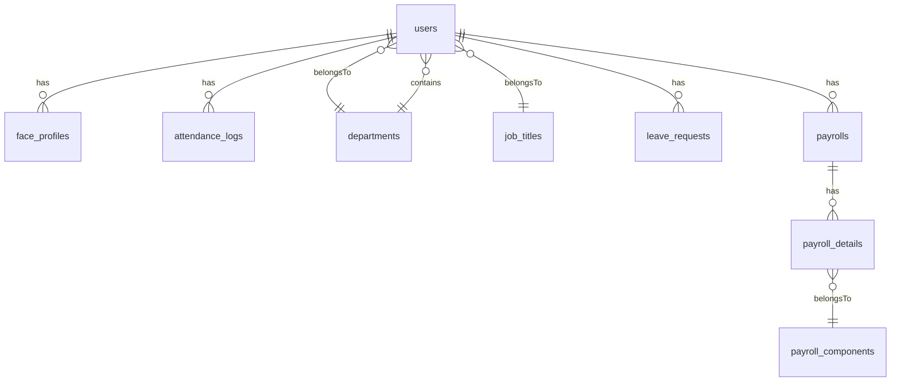

# 4. Co so du lieu (PostgreSQL / Sequelize)

## 4.1. Tong quan
- **So bang (model) chinh trong tai lieu nay:** **30** bang PostgreSQL tuong ung cac file trong `src/models/pg`.
- Hau het bang dung timestamps Sequelize: *(co `createdAt`, `updatedAt` Sequelize tru khi ghi chu khac)*
- Co thu muc **MongoDB** (`mongoose`) trong repo nhung **khong phai kho du lieu chinh** cua luong dang mo ta.

### 4.1.1. Gom nhom bang theo nghiep vu (de viet Word / slide)

| Nhom | Ten bang / model (ten Sequelize) | Vai tro tom tat |
|------|----------------------------------|-----------------|
| **Tai khoan & to chuc** | `User`, `Department`, `JobTitle`, `SalaryGrade`, `RoleChangeAudit` | Nguoi dung, phong, chuc danh, ngach, audit doi role |
| **Cham cong & ca** | `FaceProfile`, `AttendanceLog`, `ShiftSetting` | Embedding mat, log cham cong, cau hinh gio lam |
| **Don tu & duyet** | `LeaveRequest`, `OvertimeRequest`, `BusinessTripRequest`, `SalaryAdvance`, `ApprovalWorkflow` | Nghi, tang ca, cong tac, tam ung, buoc duyet |
| **Luong don gian & quy tac** | `Salary`, `SalaryRule`, `JobHistory`, `SalaryHistory` | Bang luong thang, quy tac thuong phat, lich su bo nhiem / luong |
| **Payroll nang cao** | `SalaryPolicy`, `PayrollComponent`, `Payroll`, `PayrollDetail` | Chinh sach theo ca, thanh phan luong, bang tong hop, dong chi tiet |
| **Bao hiem & thue (ho tro)** | `InsuranceConfig`, `InsuranceForm`, `D02LTReport` | Ty le BH, form JSON, meta bao cao D02-LT |
| **Ho so nhan su** | `Qualification`, `Dependent`, `DependentDocument`, `WorkExperience`, `Document` | Bang cap, nguoi phu thuoc, file dinh kem, kinh nghiem, tai lieu |
| **He thong** | `Notification` | Thong bao nguoi dung / broadcast |

### 4.1.2. Tru tam (hub) cua mo hinh quan he

Bang **`users`** la trung tam: hau het bang nghiep vu co `userId` hoac lien ket gian tiep qua phong/chuc danh. Quan he day du (hasMany, belongsTo) nam trong `src/models/pg/index.js`.

### 4.1.3. So do quan he rut gon (Mermaid — xuat PNG khi dan Word)

*(Day la **so do rut gon**, khong liet ke het 30 bang — du de giai thich y tuong ERD.)*

### 4.1.4. Quy uoc ten bang trong PostgreSQL

- Sequelize thuong tao ten bang dang **snake_case so nhieu** (vi du `face_profiles`, `attendance_logs`) — dung `tableName` trong model neu khac mac dinh.
- Khi doc SQL thu cong hoac export, can doi chieu voi file trong `src/models/pg/*.js`.

### 4.1.5. Kieu du lieu dac biet

- **ENUM:** mot so cot dung ENUM PostgreSQL (hop dong, gioi tinh, trang thai duyet, loai tai lieu) — tao bang lenh `DO $$ ... CREATE TYPE` trong `index.js` truoc khi sync.
- **JSON / JSONB:** `embeddings`, `metadata`, `formData`, `permissions` — luu cau truc linh hoat.

### 4.1.6. Phan biet hai khoi "luong" trong CSDL (rat quan trong khi bao cao)

He thong **khong chi co mot bang luong**: co **hai huong thiet ke** song song trong PostgreSQL. Khi noi voi thay, nen noi ro **"Khoi A"** va **"Khoi B"** de tranh lan `salaries` voi `payrolls`.

| Khoi | Ten goi trong tai lieu | Bang chinh | Khi nao dung / y nghia |
|------|------------------------|------------|-------------------------|
| **A** | Luong thang **don gian** (theo ky, co duyet) | `salaries` (+ `salary_rules`, lich su, tam ung) | Moi **mot dong** `salaries` = **mot nhan vien + mot thang + mot nam**: luu `grossSalary`, `deduction`, `finalSalary`, `status` (pending / approved / paid). Phu hop luong **tong hop nhanh**, gan voi **quy tac thuong phat** (`salary_rules`) va **cham cong**. |
| **B** | **Payroll** nang cao (policy + thanh phan + dong chi tiet) | `salary_policies`, `payroll_components`, `payrolls`, `payroll_details` | **Mot** `payrolls` gan **SalaryPolicy** (ca ngay/dem, hop dong thu viec/chinh thuc, he so OT/le/chu nhat...); **nhieu** `payroll_details` = tung khoan thu / khau tru theo `payroll_components`. Phu hop **bang luong chi tiet**, **duyet nhieu buoc** (`draft` → `pending_approval` → `approved` → `paid`). |

**Bang lien quan luong nhung khong phai "bang luong" truc tiep:**

- `salary_history` — ghi nhan **thay doi luong / phu cap** theo thoi gian (audit HR).
- `salary_grades` — **ngach** (khung); `User.salaryGradeId` lien ket.
- `job_history` — doi phong / chuc danh (anh huong khung luong theo chuc vu).
- `salary_advances` — **tam ung**; sau khi duyet co the **tru** vao ky `salaries` (`advanceDeduction`, `salaryId`).
- `insurance_configs` — **tran / san / ty le** BHXH-BHYT-BHTN — dung khi tinh **khau tru bao hiem** hoac bao cao.
- `/api/tax` + `dependents` — ho tro **tinh thue TNCN** (khong thay the bang `salaries`, ma bo sung khi giai thich **thuc linh sau thue**).

### 4.1.7. Backend gan voi luong: route, controller, service (prefix da mount trong `index.js`)

Duoi day la **API dang chay** tren server ESM chinh (`src/index.js`). Moi dong la: **HTTP prefix** → **file route** → **controller / service** → **bang Sequelize**.

**1) `/api/salary` — file `src/routes/salaryRoutes.js`**

| Method & duong dan (tom tat) | Vai tro nghiep vu | Model / service chinh |
|------------------------------|-------------------|-------------------------|
| `GET /api/salary/rules` | Liet ke quy tac thuong phat | `SalaryRule` |
| `GET/POST/PUT/DELETE .../rules/:id` | CRUD quy tac | `SalaryRule` |
| `POST /api/salary/calculate` | **Tinh luong** theo user + thang + nam | `salaryController` → `salaryCalculationService` (`calculateSalaryForUser`) → ghi `Salary` |
| `GET /api/salary` | Danh sach bang luong (co filter theo code) | `Salary` |
| `GET /api/salary/pending` | Cac ban ghi **cho duyet** | `Salary` |
| `GET /api/salary/:id` | Chi tiet mot bang luong | `Salary` |
| `GET /api/salary/:id/breakdown` | **Chi tiet thanh phan** (phan ra khoan cong/tru) | `salaryBreakdownDetailService` + `Salary` |
| `PUT .../status` | Doi trang thai (theo role duoc phep) | `Salary` |
| `PUT .../approve` | **Duyet** (supervisor / manager — theo route) | `Salary` |
| `PUT .../reject` | Tu choi | `Salary` |
| `PUT .../mark-paid` | **Danh dau da chi** (ke toan) | `Salary` |
| `PUT .../revert` | **Hoan** ve pending (manager) | `Salary` |
| `PUT .../adjust` | **Dieu chinh** so lieu (ke toan / manager) | `Salary` |

**Phan quyen (khai niem):** trong `salaryRoutes` dung middleware nhom nhu `canViewReports`, `accountantOrManager`, `supervisorOrManager`, `accountantOnly`, `managerOnly`, `staffRoles` — tuc la **khong phai ai cung xem / sua luong**; chi tiet nam trong file route + `authMiddleware` / `permissionMatrix`.

**2) `/api/seniority-salary` — `senioritySalaryRoutes.js`**

- `GET .../user/:userId` — xem thong tin **tham nien** (ho tro tang luong theo tham nien).
- `POST .../apply`, `POST .../apply-all` — ap dung tang (ke toan / manager).

**Lien ket CSDL:** cap nhat co the ghi vao `User` / `SalaryHistory` tuy logic trong `senioritySalaryService` + controller.

**3) `/api/tax` — `taxRoutes.js`**

- `GET /api/tax/calculate` — tinh thue (query theo code).
- `GET .../annual-summary` — tom tat thue nam **theo nhan vien**.
- `GET .../annual-summary-all` — tom tat cho **nhieu nhan vien** (bao cao).

**Service:** `taxService.js` — thuong dung `User`, `Dependent`, cau hinh thue trong code.

**4) `/api/salary-advances` — `salaryAdvanceRoutes.js`**

- Don **tam ung**: tao / duyet / trang thai; bang `salary_advances`; sau khi tru luong lien ket `salaryId` (cot trong bang tam ung).

**5) `/api/insurance-configs` + `/api/insurance`**

- Cau hinh ty le / tran luong: `InsuranceConfig`.
- Tinh toan bao hiem (phi employee/employer) phuc vu **gross / net** hoac bao cao — `insuranceService`.

**6) Bao cao / xuat lien quan chi phi luong**

- `GET /api/reports/payroll-cost` — `reportRoutes` + `reportService` (chi phi luong tong hop).
- `GET /api/export/payroll-cost` (hoac tuong duong trong `excelExportRoutes`) — xuat Excel chi phi luong.

**7) Khoi Payroll (Khoi B) — API trong code nhung chua gan vao server chinh**

- File **`src/routes/payrollRoutes.js`** (CommonJS `require`) + **`payrollController.js`** dinh nghia day du: CRUD `payrolls`, `payroll-components`, `salary-policies`, `calculatePayroll`, `export` Excel/PDF, v.v.
- **`index.js` (ESM) hien tai khong co `app.use('/api/payrolls', ...)`** — nen **frontend `payroll-frontend`** chi hoat dong day du khi team **mount** router nay (hoac viet lai route bang ESM) va thong nhat prefix.
- **Bang `payrolls`, `payroll_details`, ... van co trong Sequelize** — du lieu va model **da san**; thieu buoc **noi day API** neu muon dung het chuc nang file payroll cu.

### 4.1.8. Luong du lieu luong (Khoi A) — tu HR den "thuc linh"

Day la **chuoi nghiep vu** hop de ve so do hoac viet doan "Quy trinh tinh luong" trong Word:

1. **Khoi tao nhan su:** bang `users` co `baseSalary`, cac `*Allowance`, `insuranceBaseSalary`, `taxCode`, `dependentCount`, ...
2. **Thang lam viec:** `attendance_logs` (cong, muon som, OT), `leave_requests` (nghi co luong / khong luong — tuy logic tinh).
3. **Quy tac dong:** `salary_rules` (thuong / phat theo `triggerType`: muon, vang, OT, ...).
4. **Tam ung (neu co):** `salary_advances` duyet xong → khi tinh luong ky do se **tru** (`advanceDeduction` tren `salaries`).
5. **Tinh luong:** goi **`POST /api/salary/calculate`** → `salaryCalculationService` doc User + cham cong + rules (+ tam ung neu code co tinh) → tao / cap nhat **`salaries`** (`grossSalary`, `deduction`, `finalSalary`, `month`, `year`).
6. **Duyet & chi tra:** `status` `pending` → `approve` → co the `mark-paid`, ghi `paidAt`.
7. **Thue / bao hiem (giai thich them):** co the tinh rieng qua `/api/tax` va insurance — **tuy** cach ban cau hinh `finalSalary` da tru thue chua (can doc them `salaryCalculationService` khi bao cao sau cung).

### 4.1.9. Luong du lieu Payroll (Khoi B) — tom tat

1. Cau hinh **`salary_policies`** (luong ngay, he so ca, le, chu nhat...).
2. Danh muc **`payroll_components`** (khoan luong, khoan khau tru, thu tu hien thi).
3. Tao **`payrolls`** cho user + ky + `salaryPolicyId`; dien **ngay cong / OT / nghi** (cac cot `workingDays*`, `overtimeDays*`, `annualLeaveDays`).
4. Sinh **`payroll_details`**: moi dong = mot `payrollComponentId` + `quantity` x `unitAmount` = `amount`.
5. Tong hop `totalIncome`, `totalDeduction`, `netSalary`; **workflow** `status` den khi `paid`.
6. **Hien tai:** thuc hien day du qua API can **mount** `payrollRoutes` hoac tuong duong (xem 4.1.7 muc 7).

## 4.2. Danh sach bang va cot

### users (`User`)
**Chuc nang:** Nhan vien / tai khoan: dang nhap, RBAC, to chuc, luong, thong tin ca nhan.

| Cot | Mo ta |
|-----|--------|
| `id` | PK, auto increment |
| `name` | Ho ten |
| `email` | Email dang nhap, unique |
| `employeeCode` | Ma NV, unique |
| `password` | Hash mat khau |
| `role` | manager | hr | accountant | supervisor | employee |
| `isActive` | Tai khoan hoat dong |
| `deactivatedAt` | Thoi diem vo hieu hoa |
| `tokenVersion` | Vo hieu JWT cu khi doi role |
| `departmentId` | FK phong ban |
| `jobTitleId` | FK chuc danh |
| `salaryGradeId` | FK ngach luong |
| `startDate` | Ngay vao lam |
| `probationStartDate` | Bat dau thu viec |
| `probationEndDate` | Ket thuc thu viec |
| `contractType` | ENUM hop dong |
| `employmentStatus` | ENUM trang thai lam viec |
| `managerId` | FK quan ly truc tiep (users) |
| `branchName` | Chi nhanh |
| `baseSalary` | Luong co ban |
| `insuranceBaseSalary` | Luong dong BH |
| `lunchAllowance` | Phu cap an trua |
| `transportAllowance` | Phu cap di lai |
| `phoneAllowance` | Phu cap dien thoai |
| `responsibilityAllowance` | Phu cap trach nhiem |
| `phoneNumber` | Dien thoai |
| `address` | Dia chi |
| `permanentAddress` | HKTT |
| `temporaryAddress` | Tam tru |
| `bankAccount` | STK |
| `bankName` | Ngan hang |
| `bankBranch` | Chi nhanh NH |
| `taxCode` | MST ca nhan |
| `socialInsuranceNumber` | So BHXH |
| `healthInsuranceProvider` | Noi dang ky BHYT |
| `dependentCount` | So nguoi phu thuoc (goi y tinh thue) |
| `idNumber` | CCCD/CMND |
| `idIssueDate` | Ngay cap |
| `idIssuePlace` | Noi cap |
| `dateOfBirth` | Ngay sinh |
| `gender` | ENUM |
| `personalEmail` | Email ca nhan |
| `companyEmail` | Email cong ty |
| `educationLevel` | ENUM trinh do |
| `major` | Chuyen nganh |
| `emergencyContactName` | Lien he khan cap |
| `emergencyContactRelationship` | Quan he |
| `emergencyContactPhone` | SDT khan cap |
| `avatarUrl` | Duong dan anh dai dien |

*(co `createdAt`, `updatedAt` Sequelize tru khi ghi chu khac)*

### face_profiles (`FaceProfile`)
**Chuc nang:** Embedding khuon mat gan user (nhan dien cham cong).

| Cot | Mo ta |
|-----|--------|
| `id` | PK |
| `userId` | FK users |
| `modelVersion` | Phien ban model (vd faceapi-tiny) |
| `embeddings` | JSONB vector dac trung |
| `imageUrl` | Anh tham chieu |

*(co `createdAt`, `updatedAt` Sequelize tru khi ghi chu khac)*

### attendance_logs (`AttendanceLog`)
**Chuc nang:** Lich su cham cong / nhan dien.

| Cot | Mo ta |
|-----|--------|
| `id` | PK |
| `userId` | FK |
| `detectedName` | Ten nhan dien |
| `confidence` | float |
| `matchDistance` | float |
| `type` | IN | OUT |
| `note` | Ghi chu |
| `shiftId` | Tham chieu ca |
| `isLate` | boolean |
| `isEarlyLeave` | boolean |
| `isOvertime` | boolean |
| `deviceId` | Thiet bi |
| `imageBase64` | Anh snapshot (text) |
| `timestamp` | Thoi diem cham |

*(co `createdAt`, `updatedAt` Sequelize tru khi ghi chu khac)*

### shift_settings (`ShiftSetting`)
**Chuc nang:** Cau hinh gio lam chung (vao/ra, grace, nguong OT).

| Cot | Mo ta |
|-----|--------|
| `id` | PK |
| `name` | Ten ca |
| `startTime` | HH:MM |
| `endTime` | HH:MM |
| `gracePeriodMinutes` | Phut di muon cho phep |
| `overtimeThresholdMinutes` | Nguong tinh OT |
| `active` | boolean |
| `note` | TEXT |

*(co `createdAt`, `updatedAt` Sequelize tru khi ghi chu khac)*

### salaries (`Salary`)
*(Xem **muc 4.1.6–4.1.8**: day la **Khoi A** — luong thang don gian; backend chinh: **`/api/salary`**, `salaryCalculationService`.)*

**Chuc nang:** Bang luong theo thang/nam (track tinh luong don gian).

| Cot | Mo ta |
|-----|--------|
| `id` | PK |
| `userId` | FK |
| `baseSalary` | decimal |
| `bonus` | decimal |
| `grossSalary` | decimal |
| `deduction` | decimal |
| `advanceDeduction` | Tru tam ung |
| `finalSalary` | Thuc linh |
| `month` | 1–12 |
| `year` | nam |
| `status` | pending | approved | paid |
| `notes` | TEXT |
| `calculatedAt` | DATE |
| `paidAt` | DATE |

*(co `createdAt`, `updatedAt` Sequelize tru khi ghi chu khac)*

### salary_rules (`SalaryRule`)
**Chuc nang:** Quy tac thuong/phat theo trigger (muon, vang, OT...).

| Cot | Mo ta |
|-----|--------|
| `id` | PK |
| `name` | Ten quy tac |
| `type` | bonus | deduction |
| `triggerType` | late | early_leave | absent | overtime | full_attendance | custom |
| `amount` | decimal |
| `amountType` | fixed | percentage |
| `threshold` | Nguong (int) |
| `isActive` | boolean |
| `description` | TEXT |
| `priority` | int |

*(co `createdAt`, `updatedAt` Sequelize tru khi ghi chu khac)*

### job_history (`JobHistory`)
**Chuc nang:** Lich su thay doi phong ban / chuc danh.

| Cot | Mo ta |
|-----|--------|
| `id` | PK |
| `userId` | FK |
| `fromDepartmentId` | Phong cu |
| `toDepartmentId` | Phong moi |
| `fromJobTitleId` | Chuc danh cu |
| `toJobTitleId` | Chuc danh moi |
| `changeType` | ENUM hire, transfer, ... |
| `effectiveDate` | DATEONLY |
| `notes` | TEXT |
| `changedBy` | FK user thuc hien |

*(co `createdAt`, `updatedAt` Sequelize tru khi ghi chu khac)*

### salary_history (`SalaryHistory`)
**Chuc nang:** Lich su thay doi luong / phu cap.

| Cot | Mo ta |
|-----|--------|
| `id` | PK |
| `userId` | FK |
| `previousBaseSalary` | decimal |
| `newBaseSalary` | decimal |
| `previousTotalAllowance` | decimal |
| `newTotalAllowance` | decimal |
| `changeType` | ENUM |
| `effectiveDate` | DATEONLY |
| `reason` | TEXT |
| `changedBy` | FK |

*(co `createdAt`, `updatedAt` Sequelize tru khi ghi chu khac)*

### leave_requests (`LeaveRequest`)
**Chuc nang:** Don nghi phep.

| Cot | Mo ta |
|-----|--------|
| `id` | PK |
| `userId` | FK |
| `type` | ENUM loai nghi |
| `startDate` | DATEONLY |
| `endDate` | DATEONLY |
| `days` | int |
| `reason` | TEXT |
| `status` | pending | approved | rejected |
| `approvedBy` | FK |
| `approvedAt` | DATE |
| `rejectionReason` | TEXT |

*(co `createdAt`, `updatedAt` Sequelize tru khi ghi chu khac)*

### notifications (`Notification`)
**Chuc nang:** Thong bao he thong / cham cong / luong...

| Cot | Mo ta |
|-----|--------|
| `id` | PK |
| `userId` | FK hoac null = broadcast |
| `type` | ENUM attendance, late, leave, salary, ... |
| `title` | STRING |
| `message` | TEXT |
| `read` | boolean |
| `readAt` | DATE |
| `metadata` | JSONB |

*(co `createdAt`, `updatedAt` Sequelize tru khi ghi chu khac)*

### departments (`Department`)
**Chuc nang:** Phong ban.

| Cot | Mo ta |
|-----|--------|
| `id` | PK |
| `code` | unique |
| `name` | Ten |
| `description` | TEXT |
| `managerId` | FK users |
| `isActive` | boolean |

*(co `createdAt`, `updatedAt` Sequelize tru khi ghi chu khac)*

### job_titles (`JobTitle`)
**Chuc nang:** Chuc danh, quyen JSON, khung luong.

| Cot | Mo ta |
|-----|--------|
| `id` | PK |
| `code` | unique |
| `name` | Ten |
| `description` | TEXT |
| `level` | STRING |
| `permissions` | JSONB |
| `baseSalaryMin` | decimal |
| `baseSalaryMax` | decimal |
| `isActive` | boolean |

*(co `createdAt`, `updatedAt` Sequelize tru khi ghi chu khac)*

### salary_grades (`SalaryGrade`)
**Chuc nang:** Ngach luong / tham nien.

| Cot | Mo ta |
|-----|--------|
| `id` | PK |
| `code` | unique |
| `name` | Ten |
| `level` | int |
| `baseSalary` | decimal |
| `minYearsOfService` | int |
| `description` | TEXT |
| `isActive` | boolean |

*(co `createdAt`, `updatedAt` Sequelize tru khi ghi chu khac)*

### qualifications (`Qualification`)
**Chuc nang:** Bang cap / chung chi nhan vien.

| Cot | Mo ta |
|-----|--------|
| `id` | PK |
| `userId` | FK |
| `type` | certificate | degree | license | training |
| `name` | Ten |
| `issuedBy` | STRING |
| `issuedDate` | DATE |
| `expiryDate` | DATE |
| `certificateNumber` | STRING |
| `documentPath` | FILE |
| `description` | TEXT |
| `isActive` | boolean |
| `approvalStatus` | pending | approved | rejected |
| `approvedAt` | DATE |
| `approvedBy` | FK |
| `rejectionReason` | TEXT |

*(co `createdAt`, `updatedAt` Sequelize tru khi ghi chu khac)*

### dependents (`Dependent`)
**Chuc nang:** Nguoi phu thuoc giam tru gia canh.

| Cot | Mo ta |
|-----|--------|
| `id` | PK |
| `userId` | FK |
| `fullName` | STRING |
| `relationship` | ENUM |
| `dateOfBirth` | DATE |
| `gender` | ENUM |
| `idNumber` | STRING |
| `address` | TEXT |
| `phoneNumber` | STRING |
| `email` | STRING |
| `occupation` | STRING |
| `isDependent` | boolean |
| `notes` | TEXT |
| `approvalStatus` | ENUM |
| `approvedAt` | DATE |
| `approvedBy` | FK |
| `rejectionReason` | TEXT |

*(co `createdAt`, `updatedAt` Sequelize tru khi ghi chu khac)*

### work_experiences (`WorkExperience`)
**Chuc nang:** Kinh nghiem lam viec.

| Cot | Mo ta |
|-----|--------|
| `id` | PK |
| `userId` | FK |
| `companyName` | STRING |
| `position` | STRING |
| `startDate` | DATE |
| `endDate` | DATE |
| `description` | TEXT |
| `responsibilities` | TEXT |
| `achievements` | TEXT |
| `isCurrent` | boolean |

*(co `createdAt`, `updatedAt` Sequelize tru khi ghi chu khac)*

### documents (`Document`)
**Chuc nang:** Ho so dinh kem (hop dong, CCCD...).

| Cot | Mo ta |
|-----|--------|
| `id` | PK |
| `userId` | FK |
| `documentType` | ENUM |
| `title` | STRING |
| `documentPath` | PATH |
| `fileName` | STRING |
| `fileSize` | int |
| `mimeType` | STRING |
| `uploadDate` | DATE |
| `expiryDate` | DATE |
| `description` | TEXT |
| `isActive` | boolean |
| `uploadedBy` | FK |
| `notes` | TEXT |

*(co `createdAt`, `updatedAt` Sequelize tru khi ghi chu khac)*

### overtime_requests (`OvertimeRequest`)
**Chuc nang:** Dang ky lam them gio.

| Cot | Mo ta |
|-----|--------|
| `id` | PK |
| `userId` | FK |
| `date` | DATEONLY |
| `startTime` | TIME |
| `endTime` | TIME |
| `totalHours` | decimal |
| `reason` | TEXT |
| `projectName` | STRING |
| `approvalStatus` | ENUM |
| `approvedBy` | FK |
| `approvedAt` | DATE |
| `rejectionReason` | TEXT |
| `approvalLevel` | int |
| `currentApproverId` | FK |

*(co `createdAt`, `updatedAt` Sequelize tru khi ghi chu khac)*

### business_trip_requests (`BusinessTripRequest`)
**Chuc nang:** Don cong tac.

| Cot | Mo ta |
|-----|--------|
| `id` | PK |
| `userId` | FK |
| `startDate` | DATEONLY |
| `endDate` | DATEONLY |
| `destination` | STRING |
| `purpose` | TEXT |
| `estimatedCost` | decimal |
| `transportType` | ENUM |
| `accommodation` | STRING |
| `approvalStatus` | ENUM |
| `approvedBy` | FK |
| `approvedAt` | DATE |
| `rejectionReason` | TEXT |
| `approvalLevel` | int |
| `currentApproverId` | FK |

*(co `createdAt`, `updatedAt` Sequelize tru khi ghi chu khac)*

### salary_advances (`SalaryAdvance`)
**Chuc nang:** Tam ung luong.

| Cot | Mo ta |
|-----|--------|
| `id` | PK |
| `userId` | FK |
| `month` | int |
| `year` | int |
| `amount` | decimal |
| `reason` | TEXT |
| `requestDate` | DATE |
| `approvalStatus` | ENUM |
| `approvalLevel` | int |
| `currentApproverId` | FK |
| `approvedBy` | FK |
| `approvedAt` | DATE |
| `rejectionReason` | TEXT |
| `isDeducted` | boolean |
| `deductedAt` | DATE |
| `salaryId` | int (tham chieu bang salaries) |

*(co `createdAt`, `updatedAt` Sequelize tru khi ghi chu khac)*

### approval_workflows (`ApprovalWorkflow`)
**Chuc nang:** Chi tiet tung buoc duyet da cap.

| Cot | Mo ta |
|-----|--------|
| `id` | PK |
| `requestType` | leave | overtime | business_trip | salary_advance | other |
| `requestId` | ID don (polymorphic) |
| `level` | Cap duyet |
| `approverId` | FK |
| `status` | pending | approved | rejected | skipped |
| `approvedAt` | DATE |
| `comments` | TEXT |
| `isRequired` | boolean |

*(co `createdAt`, `updatedAt` Sequelize tru khi ghi chu khac)*

### insurance_configs (`InsuranceConfig`)
**Chuc nang:** Cau hinh ty le BHXH/BHYT/BHTN va tran luong.

| Cot | Mo ta |
|-----|--------|
| `id` | PK |
| `name` | unique |
| `effectiveDate` | DATEONLY |
| `expiryDate` | DATEONLY |
| `employeeSocialInsuranceRate` | decimal % |
| `employerSocialInsuranceRate` | decimal % |
| `employeeHealthInsuranceRate` | decimal % |
| `employerHealthInsuranceRate` | decimal % |
| `employeeUnemploymentInsuranceRate` | decimal % |
| `employerUnemploymentInsuranceRate` | decimal % |
| `maxInsuranceSalary` | decimal |
| `minInsuranceSalary` | decimal |
| `isActive` | boolean |
| `description` | TEXT |

*(co `createdAt`, `updatedAt` Sequelize tru khi ghi chu khac)*

### salary_policies (`SalaryPolicy`)
*(Thuoc **Khoi B** — payroll nang cao; xem **4.1.6, 4.1.7 (muc 7), 4.1.9**.)*

**Chuc nang:** Chinh sach luong theo ca ngay/dem va loai hop dong (payroll nang cao).

| Cot | Mo ta |
|-----|--------|
| `id` | PK |
| `code` | unique |
| `name` | STRING |
| `shiftType` | day | night |
| `contractType` | probation | official |
| `baseSalaryPerDay` | decimal |
| `overtimeRate` | decimal |
| `holidayRate` | decimal |
| `holidayOvertimeRate` | decimal |
| `sundayRate` | decimal |
| `sundayOvertimeRate` | decimal |
| `nightShiftBonus` | decimal |
| `description` | TEXT |
| `isActive` | boolean |
| `createdAt` | DATE |
| `updatedAt` | DATE |

### payroll_components (`PayrollComponent`)
*(**Khoi B** — thanh phan luong; lien ket `payroll_details`.)*

**Chuc nang:** Danh muc khoan thu nhap / khau tru trong payroll.

| Cot | Mo ta |
|-----|--------|
| `id` | PK |
| `code` | unique |
| `name` | STRING |
| `type` | income | deduction |
| `category` | ENUM nhom (base_salary, overtime, tax, ...) |
| `calculationMethod` | ENUM cach tinh |
| `defaultValue` | decimal |
| `isRequired` | boolean |
| `isEditable` | boolean |
| `description` | TEXT |
| `displayOrder` | int |
| `isActive` | boolean |
| `createdAt` | DATE |
| `updatedAt` | DATE |

### payrolls (`Payroll`)
*(**Khoi B** — bang tong hop payroll; API day du trong `payrollRoutes.js` co the **chua mount** — xem **4.1.7**.)*

**Chuc nang:** Bang luong tong hop payroll (Track B).

| Cot | Mo ta |
|-----|--------|
| `id` | PK |
| `userId` | FK |
| `year` | int |
| `month` | int |
| `salaryPolicyId` | FK |
| `workingDaysBase` | decimal |
| `workingDaysHoliday` | decimal |
| `workingDaysSunday` | decimal |
| `overtimeDaysBase` | decimal |
| `overtimeDaysHoliday` | decimal |
| `overtimeDaysSunday` | decimal |
| `annualLeaveDays` | decimal |
| `totalIncome` | decimal |
| `totalDeduction` | decimal |
| `netSalary` | decimal |
| `status` | draft | pending_approval | approved | paid | rejected |
| `approvedBy` | FK |
| `approvedAt` | DATE |
| `paidAt` | DATE |
| `rejectionReason` | TEXT |
| `notes` | TEXT |
| `createdAt` | DATE |
| `updatedAt` | DATE |

### payroll_details (`PayrollDetail`)
*(**Khoi B** — dong chi tiet gan `payrolls` + `payroll_components`; xem **4.1.9**.)*

**Chuc nang:** Dong chi tiet thanh phan luong.

| Cot | Mo ta |
|-----|--------|
| `id` | PK |
| `payrollId` | FK |
| `payrollComponentId` | FK |
| `quantity` | decimal |
| `unitAmount` | decimal |
| `amount` | decimal |
| `calculationFormula` | STRING |
| `notes` | TEXT |
| `isEdited` | boolean |
| `editedReason` | TEXT |
| `createdAt` | DATE |
| `updatedAt` | DATE |

### insurance_forms (`InsuranceForm`)
**Chuc nang:** Du lieu form TK1-TS / D02-LT (JSON).

| Cot | Mo ta |
|-----|--------|
| `id` | PK |
| `userId` | FK |
| `formType` | TK1_TS | D02_LT |
| `formData` | JSONB |
| `version` | int |
| `isActive` | boolean |
| `notes` | TEXT |

*(co `createdAt`, `updatedAt` Sequelize tru khi ghi chu khac)*

### d02_lt_reports (`D02LTReport`)
**Chuc nang:** Metadata bao cao D02-LT (don vi, ky).

| Cot | Mo ta |
|-----|--------|
| `id` | PK |
| `tenDonVi` | STRING |
| `maDonVi` | STRING |
| `maSoThue` | STRING |
| `diaChi` | TEXT |
| `soDienThoai` | STRING |
| `email` | STRING |
| `ngay` | int 1–31 |
| `thang` | int 1–12 |
| `nam` | int |
| `createdAt` | DATE |
| `updatedAt` | DATE |

### role_change_audits (`RoleChangeAudit`)
**Chuc nang:** Nhat ky doi role (bao mat).

| Cot | Mo ta |
|-----|--------|
| `id` | PK |
| `userId` | FK doi tuong |
| `changedBy` | FK nguoi thuc hien |
| `oldRole` | STRING |
| `newRole` | STRING |
| `reason` | TEXT |
| `ipAddress` | STRING |
| `userAgent` | STRING |

*(co `createdAt`, `updatedAt` Sequelize tru khi ghi chu khac)*

### dependent_documents (`DependentDocument`)
**Chuc nang:** File dinh kem nguoi phu thuoc.

| Cot | Mo ta |
|-----|--------|
| `id` | PK |
| `dependentId` | FK |
| `userId` | FK |
| `documentPath` | PATH |
| `fileName` | STRING |
| `fileSize` | int |
| `mimeType` | STRING |

*(co `createdAt`, `updatedAt` Sequelize tru khi ghi chu khac)*

## 4.3. Ghi chu Sequelize va van hanh CSDL

- Ten bang thuc te la `tableName` trong model (vd `face_profiles`, `users`).
- Quan he (FK, hasMany, belongsTo) duoc khai bao tap trung trong `src/models/pg/index.js`.
- **`sync({ alter: true })`:** trong `index.js` co goi dong bo schema — tren moi truong **production** thuong **tat** hoac chi dung **migration** co kiem soat de tranh thay doi cot bat ngo.
- **Migration:** thu muc `src/db/migrations/` chua script cap nhat schema (bang luong, bao hiem, lich su, ...).
- **Seed:** script `npm run db:seed` (trong backend) — tao du lieu mau cho demo.
- **Index / hieu nang:** khi du lieu lon, can them index tren cot thuong query (`userId`, `timestamp`, `month`+`year` bang luong, ...); tai lieu nay khong liet ke index vat ly — tuy chinh khi trien khai that.
- **Sao luu:** PostgreSQL can backup dinh ky (pg_dump) khi di vao van hanh that.

## 4.4. Bang — cot chi tiet (tiep theo)

Muc **4.2** ben duoi la **danh muc day du tung cot** cua 30 bang — phu luc dai, thich hop tach thanh trang rieng trong Word (dat ngat trang truoc muc 4.2 neu can).
